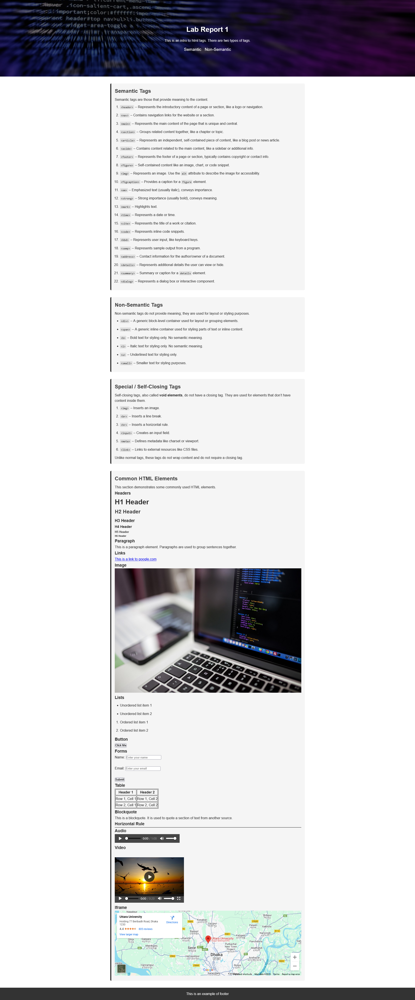

# Lab Report 1 – HTML Tags

Live Link: https://mahmuddevs.github.io/Internet-Programming-Lab-Report-1/

## Project Overview

This project is a basic HTML lab report that demonstrates different types of HTML tags, including:

- **Semantic tags** – tags that provide meaning to content, like `<header>`, `<nav>`, `<main>`, `<section>`, `<article>`, etc.
- **Non-semantic tags** – tags that are used for layout or styling purposes without providing meaning, like `
` and ``.
- **Special / Self-closing tags** – void elements that do not require a closing tag, like ``, ` `, `
`, `<input>`, `<meta>`, and `<link>`.
- **Common HTML elements** – headers, paragraphs, links, images, lists, tables, forms, audio, video, iframe, buttons, blockquote, horizontal rule, etc.

The project uses **basic CSS styling** to improve readability and demonstrate sections clearly.

---

## Project Structure

Lab-Report-1/
│
├─ index.html # Main HTML file containing the lab report
├─ style.css # Optional external CSS file (linked in HTML)
└─ README.md # Project documentation

---

## Features

- Clear separation of **semantic and non-semantic tags**.
- Examples of **self-closing tags** with explanations.
- Demonstrations of **common HTML elements** such as headers, links, images, lists, tables, forms, audio/video, and iframe.
- Responsive layout with viewport meta tag.
- Inline and external CSS for styling.

---

## How to Use

1. Open `index.html` in any modern web browser.
2. Navigate through the sections using the links in the header:

   - Semantic Tags
   - Non-Semantic Tags
   - Special / Self-Closing Tags
   - Common HTML Elements

3. Inspect and interact with different HTML elements demonstrated in the page.

---

## Notes

- The project includes an **iframe** showing an embedded Google Maps location.
- Audio and video elements are included using sample media from Pixabay.
- Images include `alt` attributes for accessibility.

---

## Author

Mahmud Rashid

## Preview

